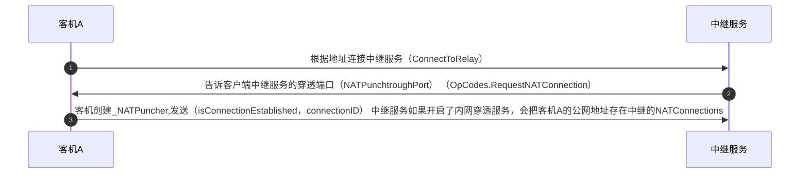
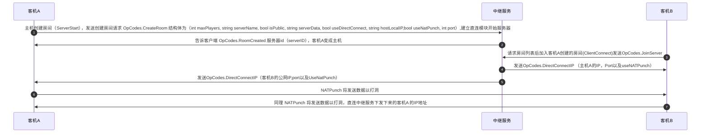
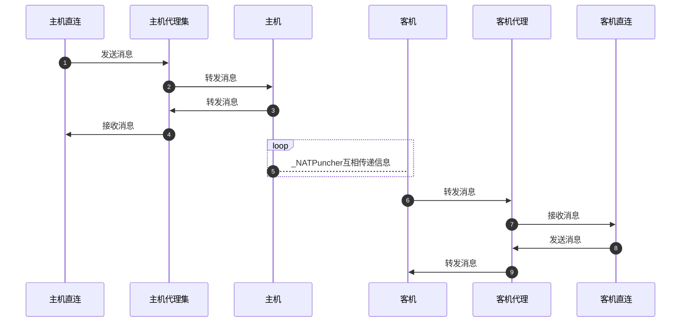
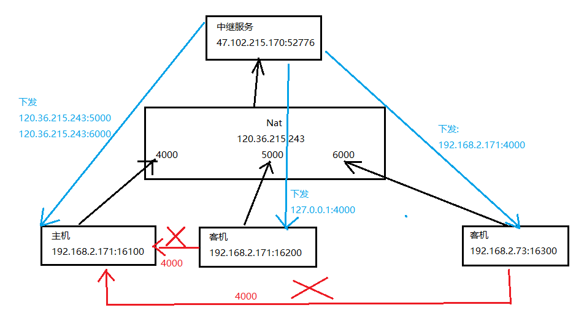
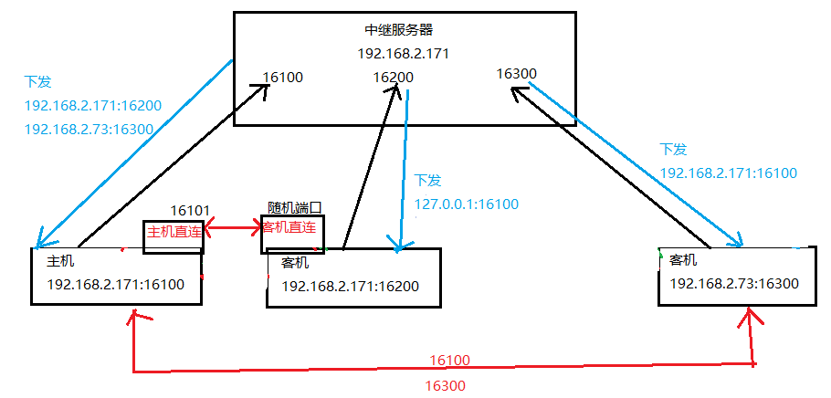
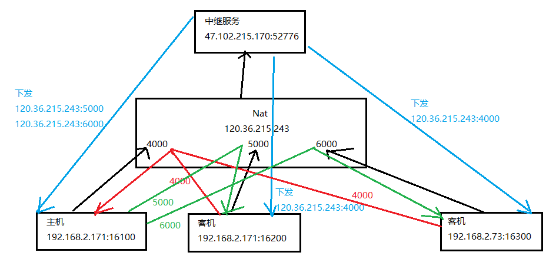
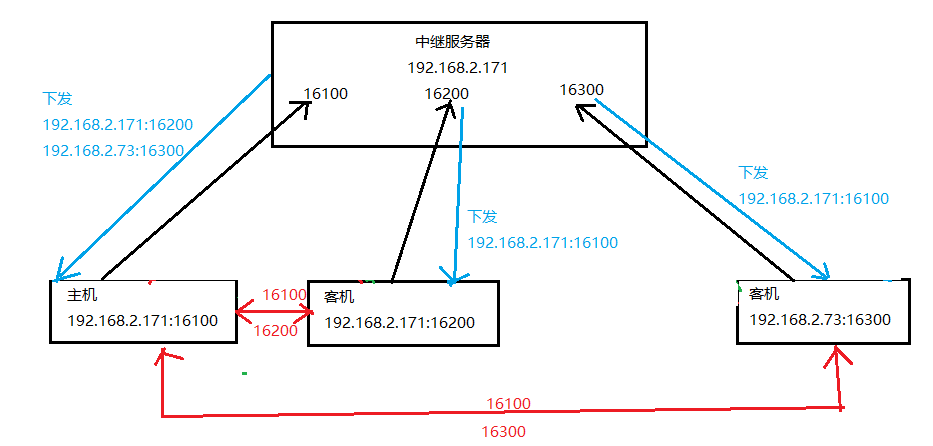

## 客户端与中继服务注册NAT公网IP地址



## NAT穿透



## 消息发送

- 主机直连:充当本地服务器
- 主机代理集:充当本地客户端集，连接主机直连
- 主机:P2P，NatPuncher
- 客机:P2P，NatPuncher
- 客机代理:充当本地服务器
- 客机直连:充当本地客户端，连接客机代理
  
  > 未修改代码：当主机客机在同一IP（同设备），原代码流程有所不同，是客机直连连接主机直连，不需要代理
  > 修改后：为了同一流程，目前流程图如下所示



## 修改方式

### 服务器

- 返回NATPunchtroughPort的修改：配置文件的NATPunchtroughPort为7776，但是重定向端口为52776，需要下发52776而不是配置文件的端口7776
- 修改方式: 将配置文件NATPunchtroughPort改为52776，并重启服务器

```
docker run -d -it --rm -p 38080:8080 -p 52777:7777/udp -p 52776:7776/udp -v /root/:/config --name lrm-node derekrs/lrm_node:Bleeding-Edge
```

- RelayHandlerRoomMethods文件的JoinRoom方法需要调整
- 除非中继和玩家在同一局域网，否则同一公网IP的玩家,公网中继下发IP:Port是错误的(私网IP+公网Port)
  
  ```
  /*if (Program.instance.NATConnections[clientId].Address.Equals(room.hostIP.Address))
    sendJoinBuffer.WriteString(ref sendJoinPos, room.hostLocalIP == localIP ? "127.0.0.1" : room.hostLocalIP);
  else
    sendJoinBuffer.WriteString(ref sendJoinPos, room.hostIP.Address.ToString());*/
  sendJoinBuffer.WriteString(ref sendJoinPos, room.hostIP.Address.ToString());
  sendJoinBuffer.WriteInt(ref sendJoinPos, room.useNATPunch ? room.hostIP.Port : room.port);
  ```

### 客户端

- LRMTransportNATPuncher类的RecvData方法，添加端口号判断
- 原因:保证同一局域网开启本地中继服务，也能同时连接同一局域网的多个玩家调试
  
  ```
  //if (!newClientEP.Address.Equals(_relayPuncherIP.Address))
  if (!newClientEP.Equals(_relayPuncherIP))
  ```
- LightReflectiveMirrorTransport类DataReceived方法，修改客机本地客户端直连实现
- 原因:客机_clientProxy端口为_NATIP.Port - 1，则直连模块需要一致的端口才能连上_clientProxy
  
  ```
  if (_clientProxy == null && useNATPunch && attemptNatPunch)
  {
    _clientProxy = new SocketProxy(_NATIP.Port - 1);
    _clientProxy.dataReceived += ClientProcessProxyData;
  }
  /*if (useNATPunch && attemptNatPunch)
  {
    if (ip == LOCALHOST)
        _directConnectModule.JoinServer(LOCALHOST, port + 1);
    else
        _directConnectModule.JoinServer(LOCALHOST, _NATIP.Port - 1);
  }
  else
    _directConnectModule.JoinServer(ip, port);
  */    
  _directConnectModule.JoinServer(LOCALHOST, _NATIP.Port - 1);
  ```

## 未修改版本的流程

> 原服务器和Unity LRM NatPunch也可以正常使用，但得保证所连接的玩家都在**不同公网**下

### 服务器部署在公网

#### 目前流程：

- 不同公网下的玩家(支持打洞)：中继服务器下发玩家的公网IP+公网Port
- 同一公网下的玩家(无法打洞)：
  - 不同设备(不同局域网IP)的玩家：中继服务器下发玩家的私网IP+公网Port
  - 同一设备(相同IP)：中继服务器下发玩家的回环地址（127.0.0.1）+公网Port     

#### 同一公网下的玩家无法打洞原因：


端口为16200的客机连接127.0.0.1:4000将失败，因为主机是16100的端口，所以无法打洞
端口为16300的客机连接192.168.2.171:4000将失败，因为主机是16100的端口，所以无法打洞


- 玩家(支持打洞)：中继服务器下发玩家的IP+Port
  
  
  ## 修改后的版本流程
  
  ### 服务器部署在公网
- 玩家(支持打洞)：中继服务器下发玩家的公网IP+公网Port
  
  
  ### 服务器部署在局域网
- 玩家(支持打洞)：中继服务器下发玩家的IP+Port
  


