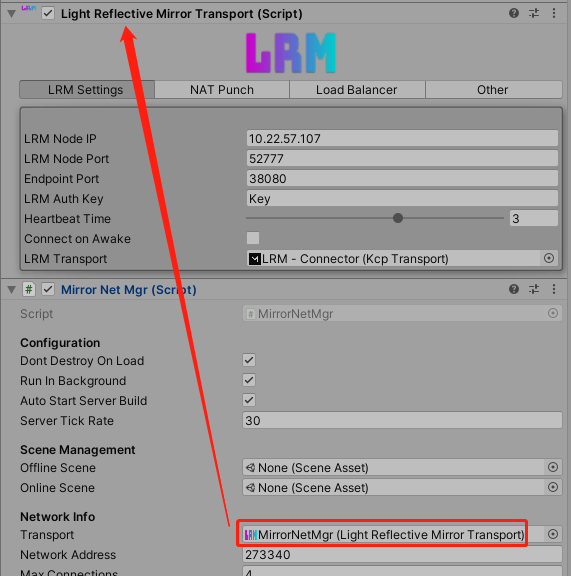

## LightReflectiveMirrorTransport

- 该组件为Mirror的中继传输组件，实现与广域网玩家p2p连接
  
- 此外提供一些事件：
  `connectedToRelay`:调用ConnectToRelay()方法，连接到中继后触发
  `disconnectedFromRelay`:与中继断开连接后触发
  `serverListUpdated`:房间列表信息，当连接到中继或调用RequestServerList()后触发
  

> 以下功能都得在连接中继后执行

## 搜索房间

搭建房间UI，通过LightReflectiveMirrorTransport组件连接中继或调用RequestServerList()，等待serverListUpdated回调，获取房间列表信息并刷新房间UI

```
//房间信息
[Serializable]
    public struct Room
    {
        public string serverName;
        public int maxPlayers;
        public string serverId;
        public string serverData;
        public int hostId;
        public List<int> clients;
        public int currentPlayers;
        public RelayAddress relayInfo;
    }
```

## 加入房间

通过**搜索房间**功能，获取房间的`serverId`，通过以下方式加入房间

```
public void JoinRoom(string serverID)
    {
        NetworkManager.singleton.networkAddress = serverID;
        NetworkManager.singleton.StartClient();
    }
```

## 创建房间

- 预先设置房间的属性信息
  
  ```
  Transport.serverName = roomName;
  Transport.extraServerData = extraData;
  Transport.maxServerPlayers = maxPlayers;
  Transport.isPublicServer = true;
  ```

- 开启主机
  
  ```
  NetworkManager.singleton.StartHost();
  ```

## 双端交互流程--联机房间生成与使用

- 服务器生成主机房间
  
  > 客户端通过**创建房间**步骤，触发服务器函数

```
private void CreateRoom(int clientId, int maxPlayers, string serverName, bool isPublic, string serverData, bool useDirectConnect, string hostLocalIP, bool useNatPunch, int port)
{
    LeaveRoom(clientId);
    Program.instance.NATConnections.TryGetValue(clientId, out IPEndPoint hostIP);

    Room room = new()
    {
        hostId = clientId,
        maxPlayers = maxPlayers,
        serverName = serverName,
        isPublic = isPublic,
        serverData = serverData,
        clients = new List<int>(),
        serverId = GetRandomServerID(),
        hostIP = hostIP,
        hostLocalIP = hostLocalIP,
        supportsDirectConnect = hostIP != null && useDirectConnect,
        port = port,
        useNATPunch = useNatPunch,
        relayInfo = new RelayAddress { address = Program.publicIP, port = Program.conf.TransportPort, endpointPort = Program.conf.EndpointPort }
    };

    rooms.Add(room);
    _cachedClientRooms.Add(clientId, room);
    _cachedRooms.Add(room.serverId, room);

    int pos = 0;
    byte[] sendBuffer = _sendBuffers.Rent(5);

    sendBuffer.WriteByte(ref pos, (byte)OpCodes.RoomCreated);
    sendBuffer.WriteString(ref pos, room.serverId);

    Program.transport.ServerSend(clientId, 0, new ArraySegment<byte>(sendBuffer, 0, pos));
    _sendBuffers.Return(sendBuffer);

    Endpoint.RoomsModified();
}
private string GetRandomServerID()
{
    if (!Program.conf.UseLoadBalancer)
    {
        return GenerateRoomID();
    }
    else
    {
        // ping load balancer here
        var uri = new Uri($"http://{Program.conf.LoadBalancerAddress}:{Program.conf.LoadBalancerPort}/api/get/id");
        string randomID = Program.webClient.DownloadString(uri).Replace("\\r", "").Replace("\\n", "").Trim();

        return randomID;
    }
}
private string GenerateRoomID()
{
    const string chars = "ABCDEFGHIJKLMNOPQRSTUVWXYZ";
    var randomID = "";
    var random = _cachedRandom;

    do
    {
        randomID = new string(Enumerable.Repeat(chars, Program.conf.RandomlyGeneratedIDLength)
                                                .Select(s => s[random.Next(s.Length)]).ToArray());
    }
    while (DoesServerIdExist(randomID));

    return randomID;
}
```

- 客户端搜索房间信息
  
  ```
  public Task<List<Room>> GetRooms()
  {
    CancellationTokenSource tokenSource = new CancellationTokenSource();
    TaskCompletionSource<List<Room>> tcs = new TaskCompletionSource<List<Room>>();
    bool seted = false;
    Transport.serverListUpdated.RemoveAllListeners();
    Transport.serverListUpdated.AddListener(() =>
    {
        if (seted) return;
        seted = true;
        tcs.SetResult(Transport.relayServerList);
        tokenSource.Cancel();
        Transport.serverListUpdated.RemoveAllListeners();
    });
    Task.Factory.StartNew(async () =>
    {
        await Task.Delay(10000, tokenSource.Token);
        if (seted) return;
        seted = true;
        tcs.SetResult(null);
    }, tokenSource.Token);
    if (!Transport.Available()) Transport.ConnectToRelay();
    else Transport.RequestServerList();
    return tcs.Task;
  }
  ```

- 客户端请求加入房间
  
  > 客户端通过**加入房间**步骤，进一步执行以下方法
  
  ```
  public override void ClientConnect(string address)
  {
    if (!Available())
    {
        Debug.Log("Not connected to relay!");
        OnClientDisconnected?.Invoke();
        return;
    }
    if (_isClient || _isServer)
        throw new Exception("Cannot connect while hosting/already connected!");
    _cachedHostID = address;
    var room = GetServerForID(address);
    if (!useLoadBalancer)
    {
        int pos = 0;
        _directConnected = false;
        _clientSendBuffer.WriteByte(ref pos, (byte)OpCodes.JoinServer);
        _clientSendBuffer.WriteString(ref pos, address);
        _clientSendBuffer.WriteBool(ref pos, _directConnectModule != null);
  
        if (_directConnectModule == null)
        {
            _clientSendBuffer.WriteString(ref pos, "0.0.0.0");
        }
        else
        {
            if (GetLocalIp() == null)
                _clientSendBuffer.WriteString(ref pos, "0.0.0.0");
            else
                _clientSendBuffer.WriteString(ref pos, GetLocalIp());
        }
        _isClient = true;
  OR_40_0_OR_NEWER
        clientToServerTransport.ClientSend(new System.ArraySegment<byte>(_clientSendBuffer, 0, pos), 0);
        clientToServerTransport.ClientSend(0, new System.ArraySegment<byte>(_clientSendBuffer, 0, pos));
    }
    else
    {
        StartCoroutine(JoinOtherRelayAndMatch(room, address));
    }
  }
  ```

- 服务端响应加入房间
  
  ```
  private void JoinRoom(int clientId, string serverId, bool canDirectConnect, string localIP)
  {
    LeaveRoom(clientId);
  
    if (_cachedRooms.ContainsKey(serverId))
    {
        var room = _cachedRooms[serverId];
  
        if (room.clients.Count < room.maxPlayers)
        {
            room.clients.Add(clientId);
            _cachedClientRooms.Add(clientId, room);
  
            int sendJoinPos = 0;
            byte[] sendJoinBuffer = _sendBuffers.Rent(500);
  
            if (canDirectConnect && Program.instance.NATConnections.ContainsKey(clientId) && room.supportsDirectConnect)
            {
                sendJoinBuffer.WriteByte(ref sendJoinPos, (byte)OpCodes.DirectConnectIP);
  
                if (Program.instance.NATConnections[clientId].Address.Equals(room.hostIP.Address))
                    sendJoinBuffer.WriteString(ref sendJoinPos, room.hostLocalIP == localIP ? "127.0.0.1" : room.hostLocalIP);
                else
                    sendJoinBuffer.WriteString(ref sendJoinPos, room.hostIP.Address.ToString());
  
                sendJoinBuffer.WriteInt(ref sendJoinPos, room.useNATPunch ? room.hostIP.Port : room.port);
                sendJoinBuffer.WriteBool(ref sendJoinPos, room.useNATPunch);
  
                Program.transport.ServerSend(clientId, 0, new ArraySegment<byte>(sendJoinBuffer, 0, sendJoinPos));
  
                if (room.useNATPunch)
                {
                    sendJoinPos = 0;
                    sendJoinBuffer.WriteByte(ref sendJoinPos, (byte)OpCodes.DirectConnectIP);
  
                    sendJoinBuffer.WriteString(ref sendJoinPos, Program.instance.NATConnections[clientId].Address.ToString());
                    sendJoinBuffer.WriteInt(ref sendJoinPos, Program.instance.NATConnections[clientId].Port);
                    sendJoinBuffer.WriteBool(ref sendJoinPos, true);
  
                    Program.transport.ServerSend(room.hostId, 0, new ArraySegment<byte>(sendJoinBuffer, 0, sendJoinPos));
                }
  
                _sendBuffers.Return(sendJoinBuffer);
  
                Endpoint.RoomsModified();
                return;
            }
            else
            {
                sendJoinBuffer.WriteByte(ref sendJoinPos, (byte)OpCodes.ServerJoined);
                sendJoinBuffer.WriteInt(ref sendJoinPos, clientId);
  
                Program.transport.ServerSend(clientId, 0, new ArraySegment<byte>(sendJoinBuffer, 0, sendJoinPos));
                Program.transport.ServerSend(room.hostId, 0, new ArraySegment<byte>(sendJoinBuffer, 0, sendJoinPos));
                _sendBuffers.Return(sendJoinBuffer);
  
                Endpoint.RoomsModified();
                return;
            }
        }
    }
  
    // If it got to here, then the server was not found, or full. Tell the client.
    int pos = 0;
    byte[] sendBuffer = _sendBuffers.Rent(1);
  
    sendBuffer.WriteByte(ref pos, (byte)OpCodes.ServerLeft);
  
    Program.transport.ServerSend(clientId, 0, new ArraySegment<byte>(sendBuffer, 0, pos));
    _sendBuffers.Return(sendBuffer);
  }
  ```

### Transport

- 连接中继的KcpTransport配置，本地超时20s
  
- P2P的KcpTransport配置，本地超时5s
  
- 中继服务器的配置

```
{
 "TransportClass": "kcp2k.KcpTransport",
 "AuthenticationKey": "FeiyuTechCenter",
 "TransportPort": 52777,
 "UpdateLoopTime": 10,
 "UpdateHeartbeatInterval": 100,
 "RandomlyGeneratedIDLength": 5,
 "UseEndpoint": true,
 "EndpointPort": 38080,
 "EndpointServerList": true,
 "EnableNATPunchtroughServer": true,
 "NATPunchtroughPort": 52776,
 "UseLoadBalancer": false,
 "LoadBalancerAuthKey": "FeiyuTechCenter",
 "LoadBalancerAddress": "127.0.0.1",
 "LoadBalancerPort": 7070,
 "LoadBalancerRegion": 1
}
```

- P2P尝试5s是否能连接，失败则通知中继服务器再次加入房间`JoinRoom`，中继服务器再下发各端通过中继连接

- 中继超时10s会通知主机踢人，此时客机不知道是否掉线，所以客机自己有20s超时检测是否掉线
